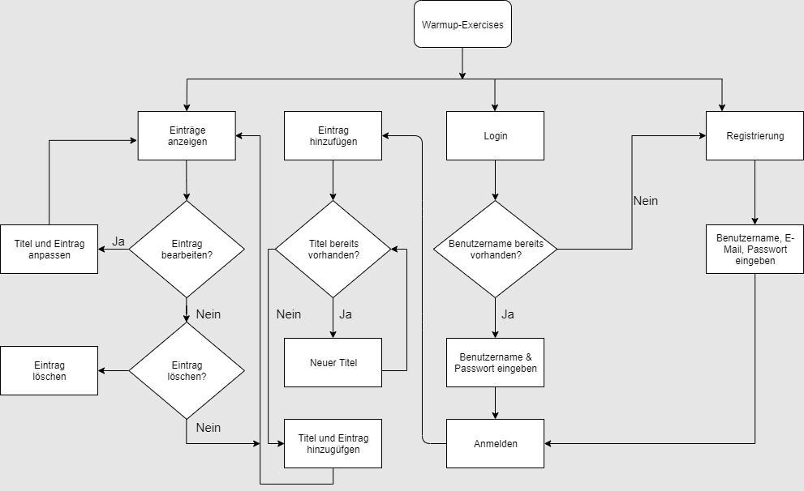

# *Warmup-Exercises*

Im Modul «Einführung Programmieren 2» an der Fachhochschule Graubünden muss im dritten Semester ein Python-Programm geschrieben werden.

Die Beschreibung dazu lautet:
**Mithilfe des Microframeworks Flask soll eine Webapplikation (App) entwickelt werden.**

Die Idee zum Projekt entstand dadurch, das Trainer unseres Sportvereines Mühe haben, kreative Idee für das Einlaufen zu finden. Diese Webapplikation soll dabei helfen, die verschiedenen Ideen der Trainer zusammenzuführen.

## Verwendung

Trainer können in einer Webanwendung Übungen hinzufügen und so den anderen zur Verfügung stellen. Dazu müssen sie ein Login erstellen und mit diesem Benutzer anschliessend eine Übung hinzufügen. Die Übungen können anschliessend auch überarbeite und gelöscht werden.

## Anforderung

- Loginmöglichkeit mit Passwortabfrage für die Trainer
- Einfaches Hinzufügen der Übung
- Einfaches Ändern der Übungen
- Einfaches Löschen der Übungen
- Speicherung der Benutzer in einer Datenbank
- Speicherung der Übungen in einer Datenbank
- Gesamtanzahl der Übungen wird angezeigt

## Test-Login

Loginname: test@test.ch
Passwort: test123

## Workflow

Die Aufgabe ist am Tutorial von [CoreyMSchafer](https://www.youtube.com/channel/UCCezIgC97PvUuR4_gbFUs5g) angelehnt und den eigenen Anforderungen angepasst.